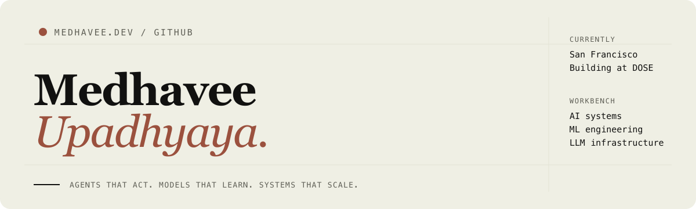

  

  <strong>AI/ML Engineer building agentic systems and production AI applications.</strong> 
  Founding Software Developer at <a href="https://www.getdose.app/">DOSE</a> · San Francisco

  <a href="https://www.medhaveeupadhyaya.com/"><strong>Portfolio ↗</strong></a>&nbsp;&nbsp;&nbsp;
  <a href="https://medium.com/@medhaveeupadhyaya">Writing ↗</a>&nbsp;&nbsp;&nbsp;
  <a href="https://www.linkedin.com/in/medhavee-upadhyaya/">LinkedIn ↗</a>

I build AI systems that do more than generate text: agents that operate in changing environments, data pipelines that turn messy evidence into decisions, and ML experiments that explain why a model behaves the way it does.

Right now I am shipping production Claude-powered experiences at **DOSE**, contributing to **vLLM**, and working deeper into model training and inference.

---

## What I am building

### [NeuroField](https://github.com/medhavee-upadhyaya/NeuroField) — autonomous agents in a living world

A multi-agent system that manages a simulated 100-sector farm. A supervisor plans, a worker acts through tools, outcomes feed back into memory, and the world updates live through FastAPI and WebSockets.

`Python` · `Claude` · `Agents` · `Tool Use` · `FastAPI` · `WebSockets` · `SQLite` · `React`

### [Reality Drift](https://github.com/medhavee-upadhyaya/reality-drift) — AI that compares claims with evidence

An end-to-end AI product that gathers public and regulatory data, runs a multi-stage Claude analysis pipeline, scores the gap between corporate language and filings, stores history in a knowledge graph, and streams results to a Next.js interface.

`Python` · `FastAPI` · `Claude` · `Knowledge Graphs` · `SSE` · `Next.js` · `TypeScript`

---

## ML experiments

### [Single Model vs. Ensemble on CIFAR-10](https://github.com/medhavee-upadhyaya/single-model-vs-ensemble-cifar10)

A controlled PyTorch study asking whether ensembles improve predictions because of model diversity—or simply because they receive more training compute.

| Result | Finding |
|:--|:--|
| **81.4%** | Compute-matched single model accuracy |
| **78.1%** | Five-model ensemble accuracy |
| **71.3%** | Baseline CNN accuracy |
| **0.0439 ECE** | The baseline was the best-calibrated model |

The ensemble became more robust under some distribution shifts, but the compute-matched model won on clean accuracy and calibration. The project includes actual predictions, corruption sweeps, reliability diagrams, and an honest negative MC-Dropout result.

---

## Open source

### [vLLM PR #52279](https://github.com/vllm-project/vllm/pull/52279) — engine-backed tool parsing

An open bugfix for vLLM's tool-calling infrastructure. The change preserves parser-engine normalized content when no tool call is produced, adds regression coverage for engine and non-engine paths, and passes:

- **106** focused parser tests
- **3,784** parser-engine tests
- Relevant pre-commit checks

This is the direction I am actively growing: understanding and contributing to the infrastructure beneath LLM APIs.

---

## AI developer infrastructure

### [CodeCheck](https://github.com/medhavee-upadhyaya/codecheck)

A 23-package, multi-provider developer platform that brings AI-generated analysis into commits, CI, GitHub pull requests, Slack, VS Code, and a live dashboard. It supports Claude, OpenAI, Gemini, and local Ollama models through composable triggers, scopes, and outputs.

`TypeScript` · `MCP` · `Structured Outputs` · `Multi-provider LLMs` · `GitHub Actions`

---

## Technical range

<pre>
AI systems       agents · tool calling · structured outputs · MCP · prompt caching
Machine learning PyTorch · CNNs · ensembles · calibration · distribution shift
Backend          Python · FastAPI · async systems · WebSockets · SSE · REST APIs
Frontend         TypeScript · React · Next.js · data visualization
Infrastructure   vLLM · GitHub Actions · CI/CD · model-serving fundamentals
</pre>

---

## Writing

- [When models fail quietly: what small data shifts reveal about ML behavior](https://medium.com/@medhaveeupadhyaya/when-models-fail-quietly-what-small-data-shifts-reveal-about-ml-reliability-b39afccdc78e)
- [Building a tool that makes your code test itself](https://medium.com/@medhaveeupadhyaya/i-built-a-tool-that-makes-your-code-test-itself-heres-everything-i-learned-48ed7d40bb3d)
- [Building a self-healing mobile automation framework](https://medium.com/@medhaveeupadhyaya/building-a-self-healing-mobile-automation-framework-appium-ai-locator-recovery-and-visual-3ba73389a763)

<a href="https://medium.com/@medhaveeupadhyaya"><strong>Read more →</strong></a>

---

## Let's build

I am interested in agentic systems, applied ML, LLM infrastructure, model training, inference, and AI products that solve real problems.

**[Explore the full portfolio →](https://www.medhaveeupadhyaya.com/)**

San Francisco · building production AI at DOSE · contributing in public
